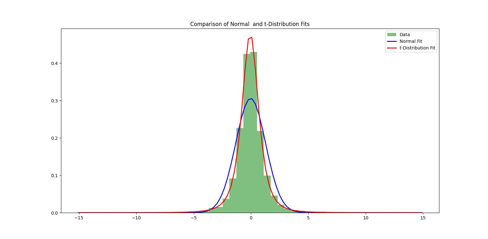
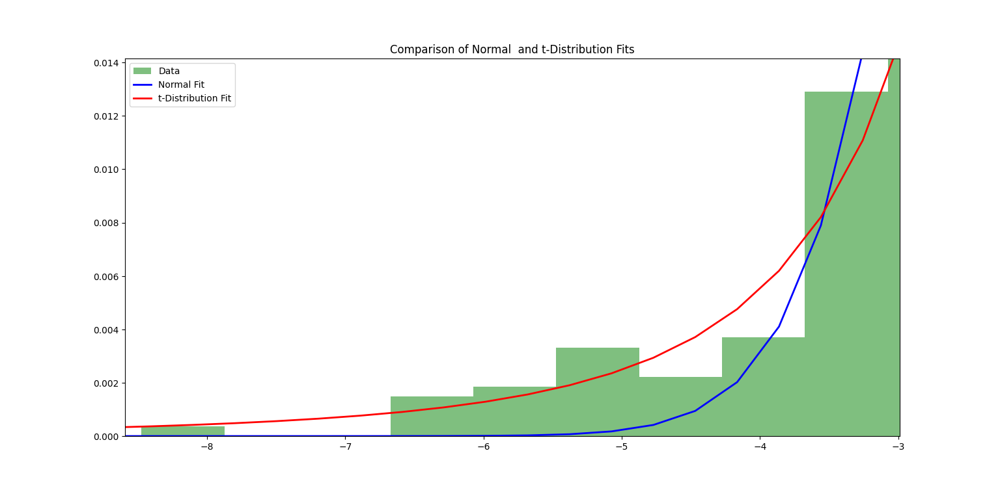
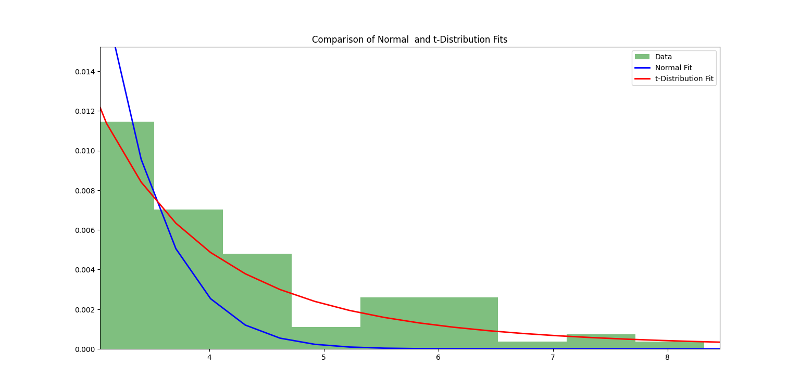

# Distribution Analysis of Daily Percentage Returns of Nifty 50

## Steps:

### 1. Data Sourcing:
Nifty 50 data was downloaded from Kaggle, covering the period from 17 Sep 2007 to 16 Feb 2026.

### 2. Data Preprocessing:
a. Commas were removed from the values of Close Price for further calculations.\
b. Daily percentage change in close price was calculated .

### 3. Normality Test:
**Reason:** Data was assumed to follow the Normal Distribution as baseline .

**Tests Performed :** Shapiro-Wilk Test , Kolmogorov-Smirnov (KS) Test 

**Outputs of test :**\
Shapiro-Wilk Test Statistic: 0.8849108279585431\
Shapiro-Wilk Test p-value: 9.496275851454806e-50

KS Test\
Statistic: 0.08792475801328803\
p-value: 7.828607546219425e-31

**Conclusion of Tests:**\
p-values for both the tests are significantly less than 0.05 .\
Hence, we reject the null hypothesis of normality in daily percentage returns Nifty 50 data.

### 4. Further Analysis :
After normality test was failed . The **skewness and kurtosis** of Daily percentage returns was computed .\
**Outputs:**\
Skewness: 0.6160282875216987\
Kurtosis: 15.377373210158499

**Conclusion from outputs:**\
Kurtosis: For normal distribution , ideal kurtosis is 3 . Where as kurtosis of daily percentage returns is much higher than 3. \
It suggests fat tails indicating more percentage outliers than what normal distribution expects.

Skewness: Ideal skewness is 0 . The distribution is moderately right skewed which means occasional large positive returns.

### 5. T-Distribution:
**Reason:** The high kurtosis suggest fat tails and the outliers can be both negative and positive as returns could be both negative and positive .

**T-Distribution Properties :**
1. Fat tail distribution
2. Spread over both negative and positive amounts over x axis

**T distribution Curve was fitted with scipy.stats library**

## Comparison
**Graphical Comparison**

**Graphical Components :**
1. Histogram of density distribution of percentage daily returns.
2. Normal Distribution Curve
3. T-Distribution Curve

**Conclusion :** As seen in graph , clearly T-Distribution is better fit than Normal Distribution.

**Tails Graphical Analysis:**

As the kurtosis very high suggesting fat tails ,we must analyse the tails.

**Left Tail**

**Right Tail**

**Conclusion :** As seen in both graphs focusing on tails , T-Distribution is a better fit taking tails in account.

**Overall Conclusion :** T-Distribution is better fit than Normal Distribution for both whole analysis and tails analysis. 

## Financial Conclusions
**1.Tail Risks:** Extremely high kurtosis (~ 15 ) suggests that extreme market movements are more common than the normal behaviour.

**2.Right Skewed Returns** Slighlty positive skewness (~ 0.6 ) indicates occasional large gains, though risk remains dominated by extreme movements.

**Overall** , the Nifty 50 return distribution shows mild upside bias and pronounced fat tails, highlighting the frequent occurrence of extreme market events and the limitations of normal distribution assumptions in financial risk modeling.

